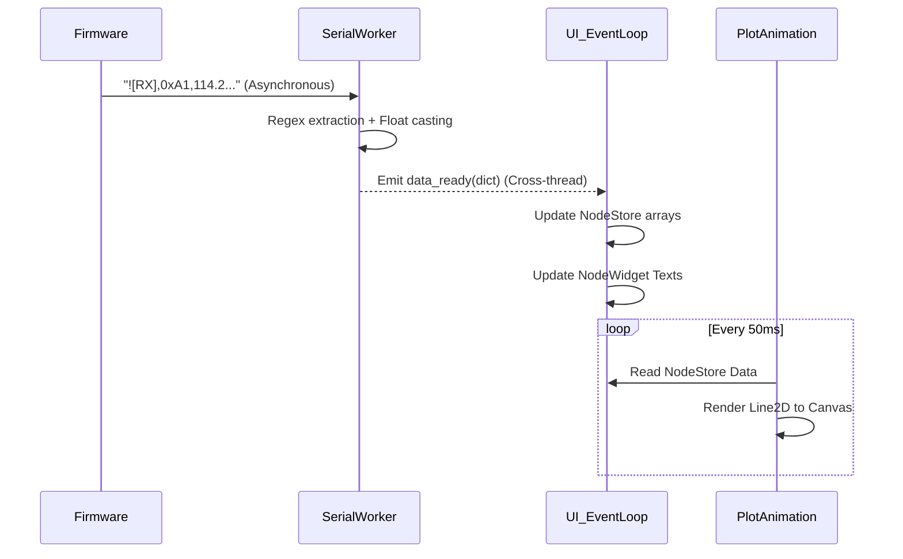

# CAN Bus Node Monitor (Telemetry App)

A PyQt6-based dashboard for monitoring and logging CAN bus node telemetry via a serial connection. This application interfaces with an ESP32-C3 Super Mini microcontroller running a CAN bus heartbeat firmware via an MCP2515 transceiver.

## Features
*   **Live Sensor Monitoring**: Real-time display of node IDs, temperatures (°F/°C), and high/low alarm statuses.
*   **Live Charting**: High-performance real-time plotting of node temperatures using Matplotlib.
*   **CSV Logging**: Stream telemetry data to a timestamped CSV file for post-analysis.
*   **Threaded Serial Worker**: Prevents UI freezing by handling serial communications on a separate background `QThread`.
*   **Interactive Commands**: Send firmware commands (e.g., `tx`, `rx`, `te`, `st <val>`) directly to the microcontroller from the UI.
*   **Dynamic Theme**: Generates highly-distinguishable vibrant colors per node, optimized for both dark and light modes.

## File Architecture
*   **`main.py`**: The simple entry point for the PyQt application.
*   **`recoder_gui.py`**: Contains the core View and Controller logic. Houses the `NodeStore` (data buffers), `NodeWidget` (UI cards), and `App` (the main window orchestrating the GUI and plots).
*   **`serial_worker.py`**: Manages the hardware serial port strictly within its own thread loop. Emits PyQt signals whenever new telemetry is fully parsed, ensuring the main UI threading is never blocked by I/O.
*   **`recoder_processing.py`**: Helper module handling regex parsing of the serial telemetry (`!RX,...` and `[RX]...` strings), error-checking, and temperature math.
*   **`prj_can_pt/prj_can_pt.ino`**: C++ ESP32 firmware for node simulation and MCP2515 CAN transceiver control.

## Installation & Requirements
Requires Python 3.10+ and the following packages:
```bash
pip install PyQt6 matplotlib pyserial
```

## Usage
1. Connect your ESP32-C3 hardware to your computer.
2. Run the application: 
   ```bash
   python main.py
   ```
3. Use the dropdowns in the **Configuration** pane to select your serial port and ensure the Baud rate matches the firmware (default: `115200`).
4. Click **Connect** to begin plotting data. 
5. (Optional) Click **Start Log** to begin recording all data to a CSV.

---

## Working Principle & Architecture

The application is built on a robust **Model-View-Controller (MVC)** framework combined with a **multi-threaded architecture**. This ensures the graphical user interface (GUI) remains butter-smooth and responsive even when inundated with a flood of serial data.

### 1. Core Architecture Diagram

The system separates hardware polling (I/O) from data presentation (GUI) using cross-thread PyQt Signals.

```mermaid
graph TD
    subgraph Hardware Layer
        ESP[ESP32-C3 Firmware] -- UART over USB --> OS[OS Serial Port]
    end

    subgraph QThread: Serial Worker
        SW[SerialWorker]
        RP[recoder_processing]
        OS -- read() --> SW
        SW -- format check --> RP
        RP -- dict --> SW
    end

    subgraph Main Thread: GUI & Controller
        APP[App Controller]
        NS[(NodeStore Model)]
        NW[NodeWidgets]
        PL[Matplotlib Canvas]
        CSV[CSV Writer]
        
        SW -- QtSignal: data_ready --> APP
        APP -- append() --> NS
        APP -- update_data() --> NW
        APP -- write() --> CSV
        NS -. FuncAnimation .-> PL
    end
    
    style Hardware Layer fill:#333333,stroke:#666,color:#fff
    style QThread: Serial Worker fill:#1E4A35,stroke:#4CAF50,color:#fff
    style Main Thread: GUI & Controller fill:#1B3A5A,stroke:#2196F3,color:#fff
```

### 2. Component Details & Data Flow

#### A. Hardware Firmware (`prj_can_pt.ino`)
The ESP32 processes CAN bus messages using the MCP2515 transceiver. When a node detects a message, it extracts the payload (converting binary structural float payloads into human-readable text) and calculates alarm thresholds.
It outputs minimal telemetry formatting over Serial, e.g., `!RX,0xA1,105.2,FF,00` where:
* `!RX` signifies a parsed message.
* `0xA1` is the CAN ID.
* `105.2` is the data payload (Temperature).
* `FF/00` indicate high and low hardware alarm flags.

#### B. The Serial Worker Thread (`serial_worker.py`)
Reading from a serial port is a blocking operation. If the Main Thread waits for serial data, the UI will freeze. 
To solve this, `SerialWorker` lives in an isolated `QThread`.
1. **Polling:** A `QTimer` fires every 20ms (`50 Hz`), efficiently draining the hardware UART buffer without blocking the CPU.
2. **Buffering:** It aggregates incomplete bytes until a newline `\n` is found. 
3. **Parsing:** Complete string lines are passed to `recoder_processing.py`, which validates them using Regex and packages the data into a standard Python Dictionaries.
4. **Signaling:** The worker fires a `data_ready.emit(parsed)` Qt Signal. Qt's event loop safely catches this and passes it across the thread boundary into the Main Thread.

#### C. Data Model (`NodeStore`)
The application requires a state structure to hold history for plotting. `NodeStore` acts as an in-memory database:
* It maps dynamic distinct colors to `node_id` strings using a hashed palette designed for high contrast.
* It allocates `collections.deque` sequences (circular buffers) limited to 1,000 max samples to prevent RAM memory leaks during infinite monitoring loops.

#### D. The Viewing App (`recoder_gui.py`)
The `App` class is the orchestrator:
* When `_on_data(dict)` receives validated data from the background thread, it appends it to the `NodeStore`.
* It pushes UI updates continuously to `NodeWidget` UI cards (which update the physical thermometer displays and Alarm badges).
* Submits newly acquired readings into a `QTreeWidget` row for tabular historical viewing.
* Appends identical data to the CSV writer without storing heavy string overheads.

#### E. Matplotlib Asynchronous Rendering
Rather than executing an expensive plot `draw()` command every single time a serial frame arrives (which would crash the UI given high frequencies), `App._start_animation()` uses Matplotlib’s `FuncAnimation`.
It runs safely at exactly `50 ms` (20 FPS). On each tick, it simply looks at the arrays inside `NodeStore` and updates the plot lines seamlessly. 


